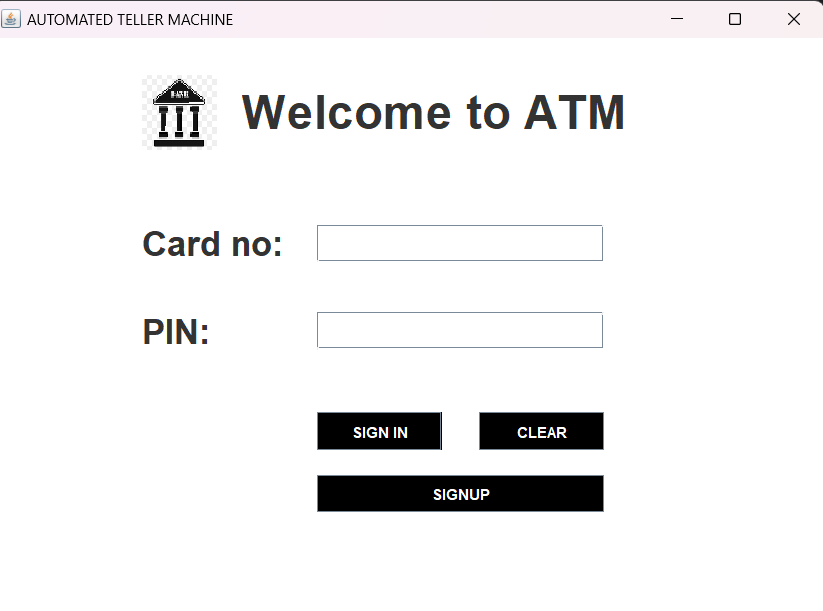
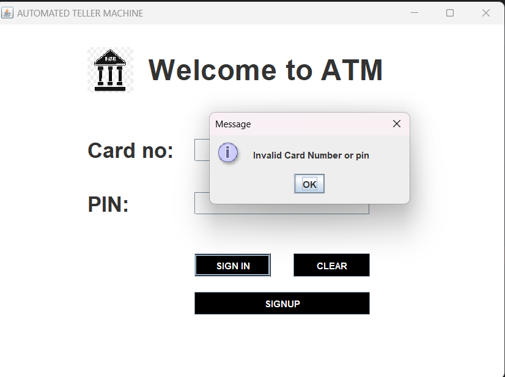
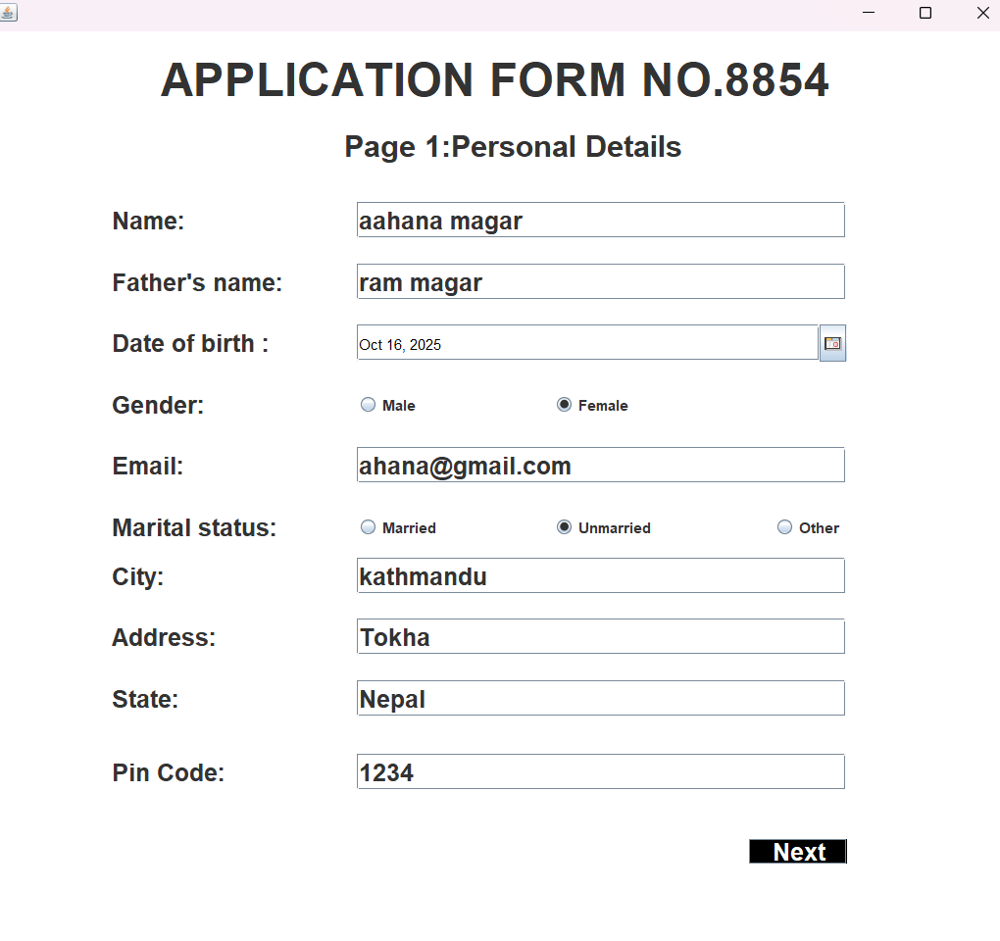
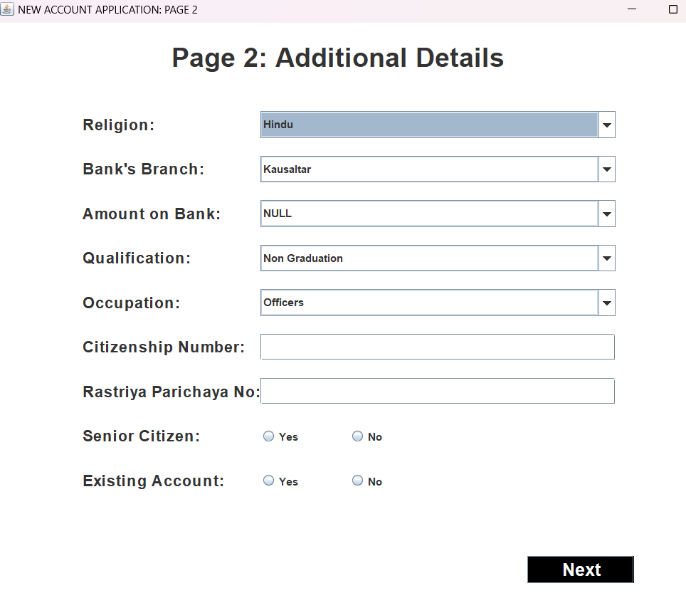
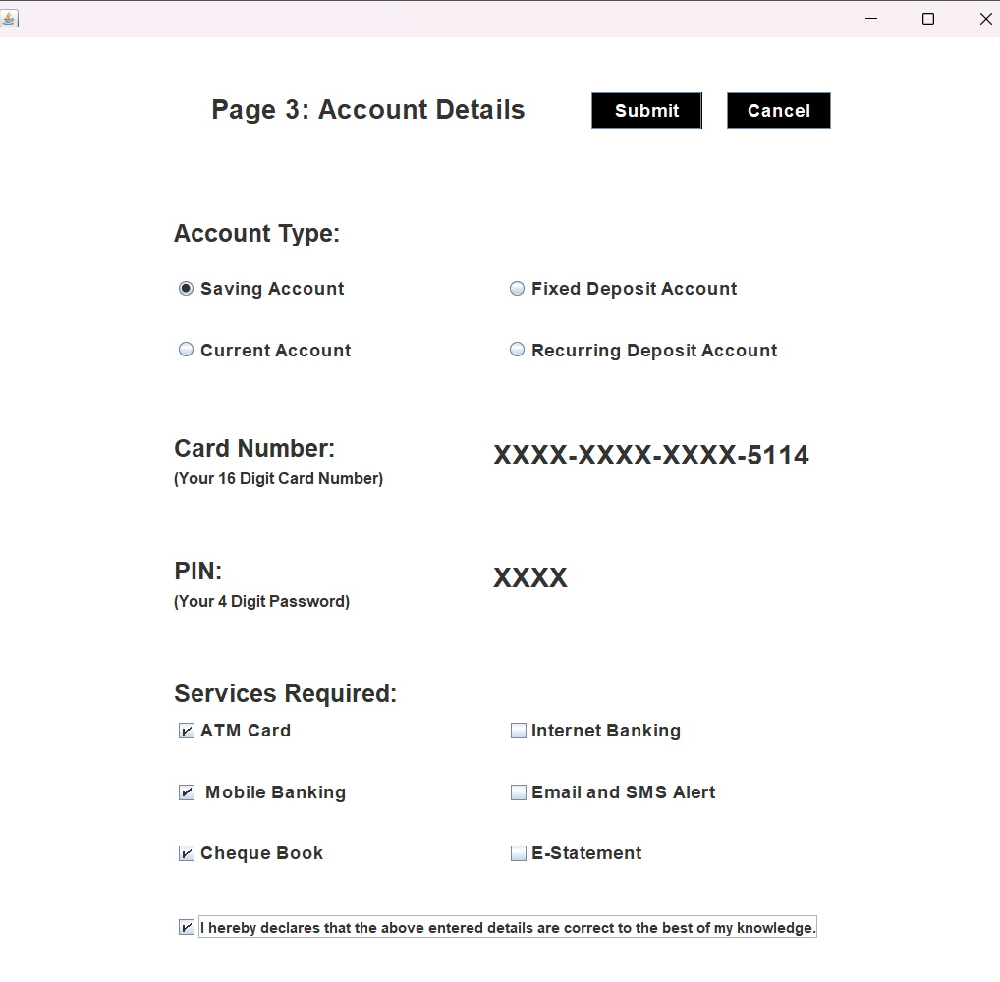
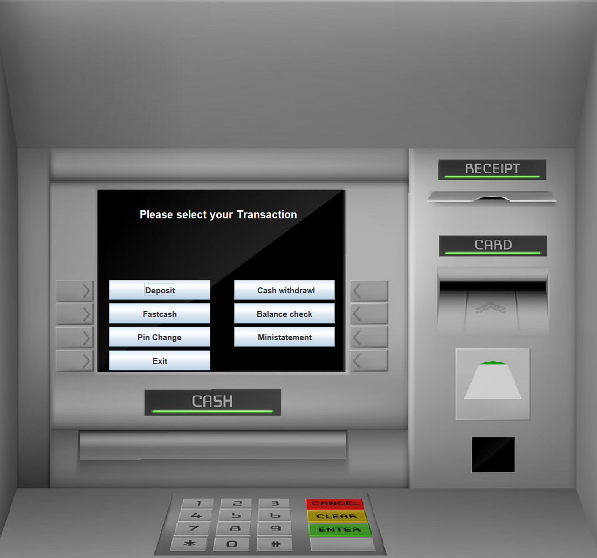
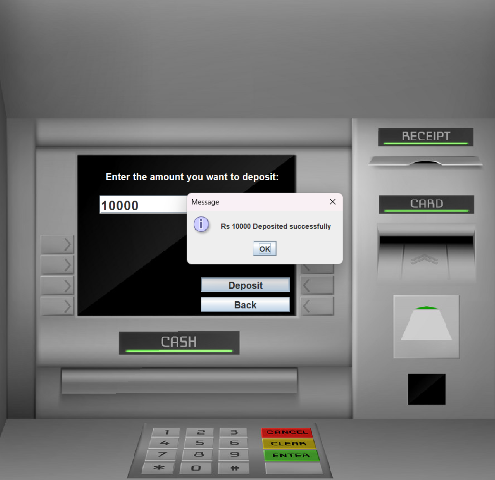
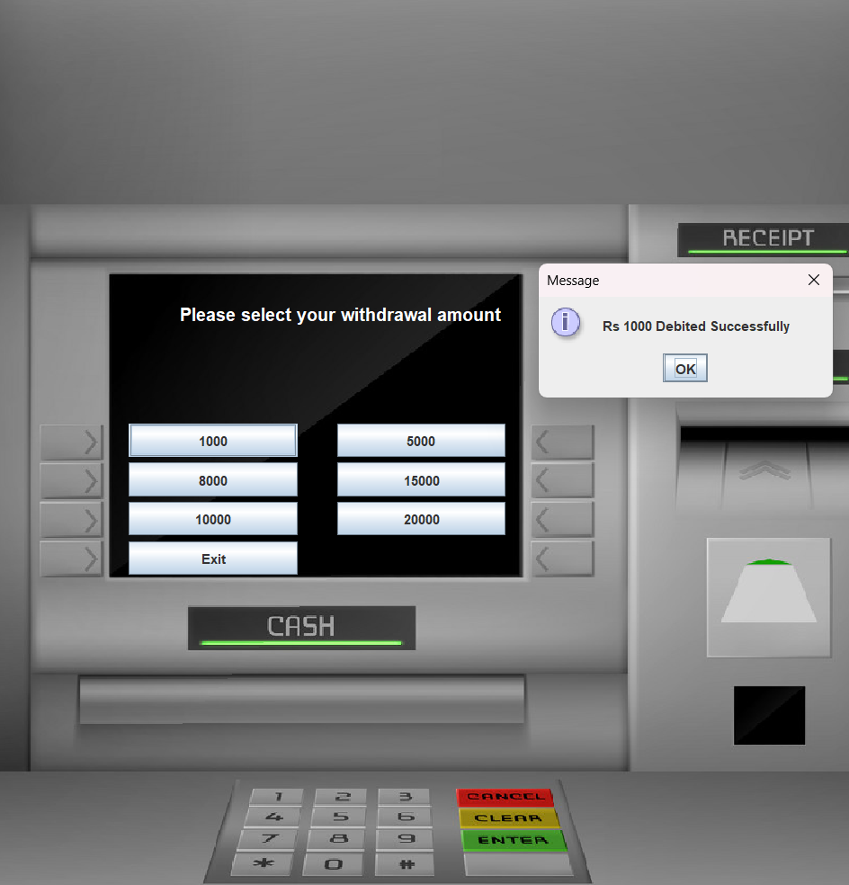
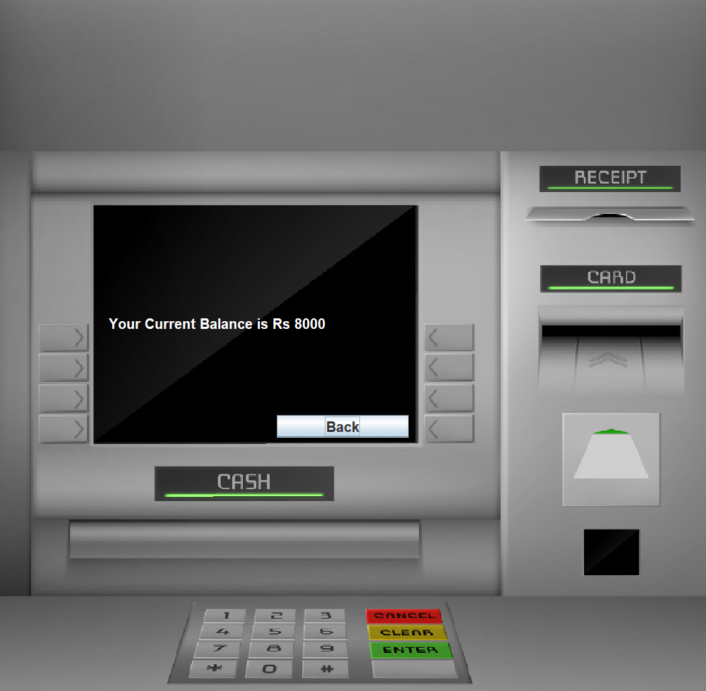

# Bank Management System:

#  Concept used:
#### Java Swing
#### Java Event Handling
#### Constructor
#### Classes and Objects
#### My SQL

# UI 
#### 1.Login Page

#### 2. Messages through dialogue box

#### 3. signin (3 pages)

#### 4.Transaction Page

#### 5.Deposit Page

#### 6.Fastcash Page

#### 7.Pinchange Page

#### 8.Balancecheck Page

