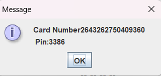
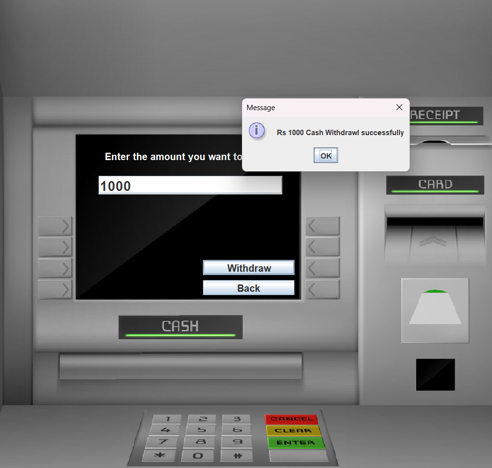
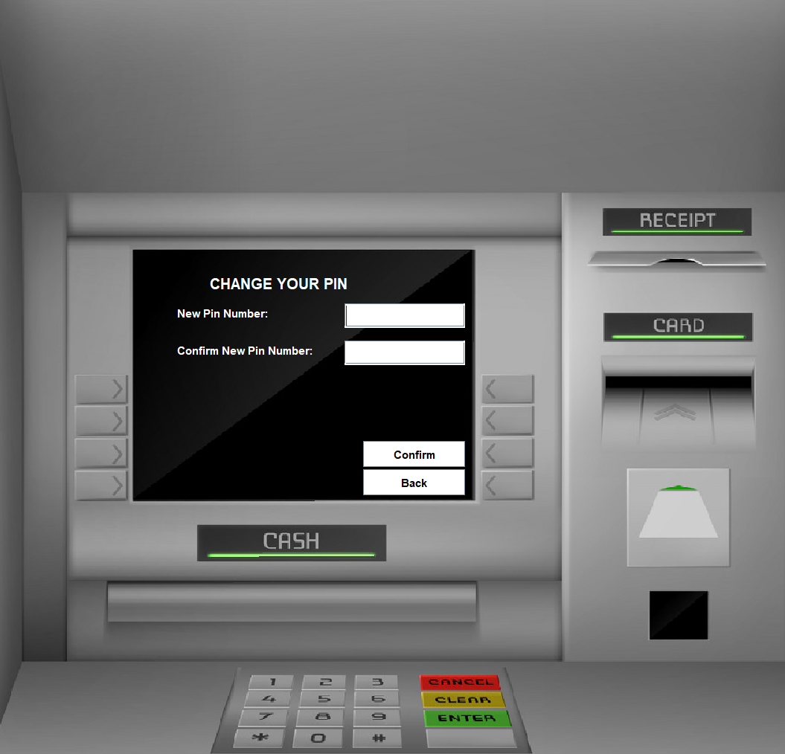

# Bank Management System:

#  Concept used:
#### Java Swing
#### Java Event Handling
#### Constructor
#### Classes and Objects
#### My SQL

# UI 
#### 1.Login Page

#### 2. Messages through dialogue box

#### 3. signin (3 pages)

#####  Randompin and cardno generation

#### 4.Transaction Page

#### 5.Deposit Page

#### 6.Fastcash Page

#### 1.withdrawl Page

#### 8.Pinchange Page

#### 9.Balancecheck Page

## My SQL tables and queries

